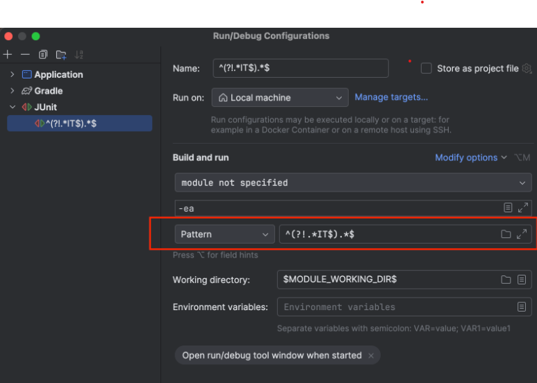
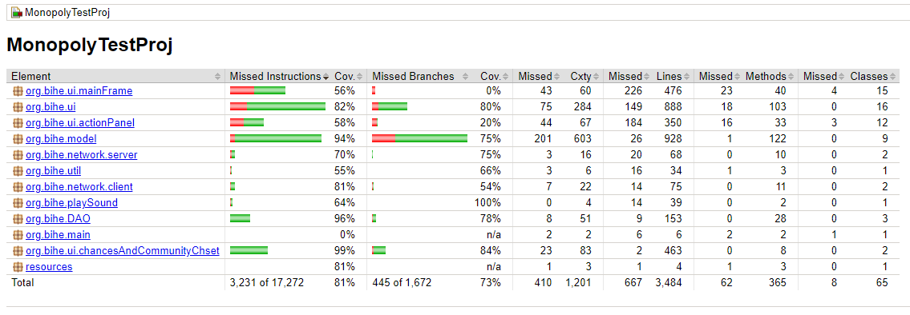

# Software Testing Final Information

### Testing artifacts/tools if any (developed/used in the testing process)
Junit, and Mockito

### The SUT (as used in the testing process).
Monopoly game as detailed in the proposal

### Test files and/or scripts, configuration files, tools etc. (needed to execute and reproduce the reported results).
The gradle file 

### Presentation slides (plus any additional documents, generated reports etc. that you like to include.)
* Presentation slides are included in the folder presentation under src - ```src/presentation```. 
* Usability testing is included in the folder usabilityTest under src - ```src/usabilityTest```. We have a separate report for each team member as previously detailed in the proposal 
* UI and integration testing is included in the folder uiIntegrationTest under src - ```src/uiIntegrationTest``` 
* Jacoco report is included in ```src/jacoco-report/test/html```, by running the ```index.html``` file you can view our current Jacoco report.

### A step-by-step instruction how to run the tests againsts the SUT and reproduce the results presented in the final presentation/live demo.
1. Input ```./gradlew clean test``` in terminal, or alternatively run the entire test suite through Intellij. This regex enables running all tests. ```^(?!.*IT$).*$```

2. To produce the Jacoco report, run the jacocoTestReport from the ```build.gradle``` file, and run the ```index.html``` file found in ```build/reports/jacoco/test/html/index.html```. This will also run all tests.


### [If applicable] Screenshots of the running tests and the achieved results.


